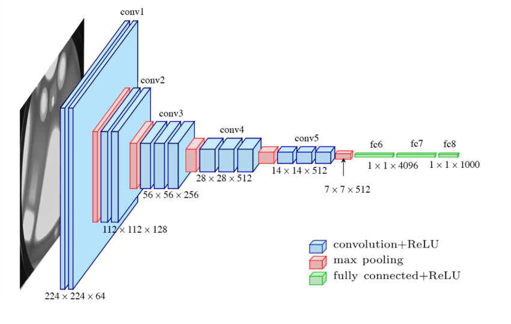

# Классификация изображений с помощью сверточной нейронной сети

- Построение свёрточной нейронной сети для классификации изображений на основе датасета Intel Image Classification.
- Взятие за основу архитектуры свёрточной нейронной сети VGG16.
- Выбор оптимального количества эпох на графике, после которого начинается переобучение.
- Построение графика точности и потерь на обучающей и валидационной выборках.
- Сравнение с предсказаниями предобученной AlexNet.

